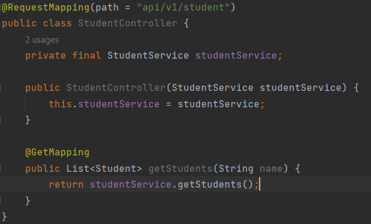

# First Project
This project has been created directly from Spring Initializer
and it has 3 dependencies:
- Spring Web
- Spring Data JPA
- PostgreSQL Driver

### Things to remember
+ The __test__ folder is where you store all of your testing code. 
+ In the __resources__ folder
  - __application.properties__ is where we configure the properties for the application, as well as __environment variables__
  - __static__ and __templates__ are for web development (HTML, CSS, JavaScript)
+ When you run this application, you can go to localhost:8080 to visualize the content.  
Add these:
  - Put __@RestController__ on top of the main class
  - create a new method with the annotation __@GetMapping__ and make it return a list
  - you will visualize a JSON on the server page  

## Adding Student Class (API LAYER)
+ Created the Student Class
+ Migrated __RestController__ from _DemoApplication_ to _StudentController_

## Adding business logic for managing students (Service Layer)
+ Created __StudentService__ class which now has the actual job to return students info
+ Things to remember:
  + In the __StudentController__ class declare an instance of __StudentService__
  + Invoke the __getStudents__ method from _controller_ but __implement it__ in _service_
  + Add __RequestMapping__ (the path you specify is to access the api at _localhost:8080/api/v1/student_)

