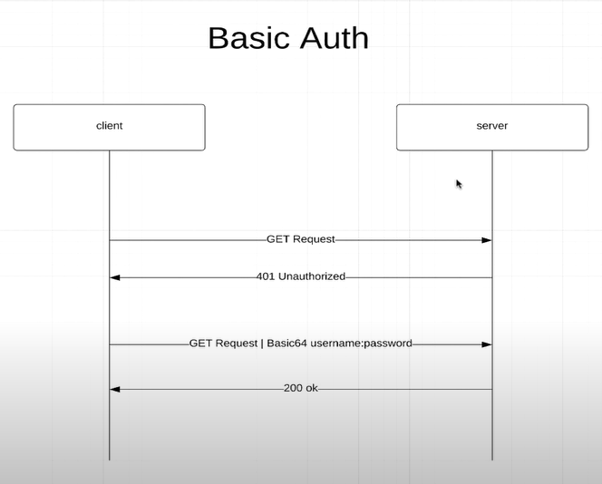
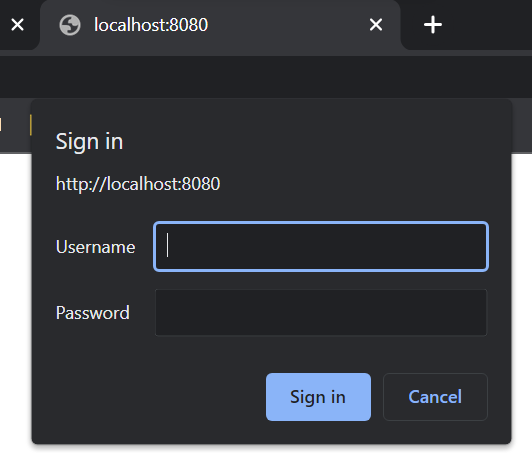

# Description

adding this dependency:

```xml
<dependency>
    <groupId>org.springframework.boot</groupId>
    <artifactId>spring-boot-starter-security</artifactId>
</dependency>
```

automatically adds _login_ form when making the requests:


to quit the session go to `localhost:8080/logout`


## Basic Auth
With this username and password are provided for every request. Hence, there is no way to _logout_.



The implementation comes with the new class `ApplicationSecurityConfig` under the `security` package.

```java
@Configuration
public class ApplicationSecurityConfig {

    @Bean
    public SecurityFilterChain filterChain(HttpSecurity http) throws Exception {
        http.authorizeHttpRequests(authz -> 
                        authz.anyRequest().authenticated()
                ).httpBasic(withDefaults());
        return http.build();
    }
}
```

Which results in the basic login method:



**_NOTE_**: In order to have [this login page](./images/login.png) displayed, just add `.formLogin()`. 

## Whitelist URLs with Ant Matchers
If you want to add an `index.html` file as the landing page for `localhost:8080`, every time you try to want to access this page you need to provide authentication.<br>
Instead, you want to have clear access to this page, and provide credentials when making API calls.

There are a few options available:
+ Method suggested by Spring docs. Inside of `ApplicationSecurityConfig` class:
```java
@Bean
public WebSecurityCustomizer webSecurityCustomizer() {
    return web -> web.ignoring().antMatchers("/", "index", "/css/*", "/js/*");
}
```
+ Other method figured out by myself. Inside of `filterChain` method:
```java
http
        .authorizeHttpRequests()
        .antMatchers("/", "index.html", "/css/*", "/js/")
        .permitAll()
        .anyRequest()
        .authenticated()
        .and()
        .httpBasic(withDefaults()).formLogin();
```

**_IMPORTANT_**: the order of the `antMatchers` you define _**DOES matter**_. 
<br>Code accordingly.

## Application Users

+ This is for adding users in an **_in-memory_** datastore:
```java
@Bean
public InMemoryUserDetailsManager userDetailsService() {
    UserDetails annaSmithUser = User.withDefaultPasswordEncoder()
        .username("annasmith")
        .password("annasmith")
        .roles("STUDENT")   // ROLE_STUDENT
        .build();
    return new InMemoryUserDetailsManager(annaSmithUser);
}
```

### Adding custom password encoding

+ Created `PasswordConfig` class:

```java
@Configuration
public class PasswordConfig {

    @Bean
    public PasswordEncoder passwordEncoder() {
        return new BCryptPasswordEncoder(10);
    }
}
```

+ Inside of `ApplicationSecurityConfig` class:

```java
@Bean
public InMemoryUserDetailsManager userDetailsService(PasswordEncoder passwordEncoder) {
    UserDetails annaSmithUser = User.builder()
        .username("annasmith")
        .password(passwordEncoder.encode("annasmith"))
        .roles("STUDENT")   // ROLE_STUDENT
        .build();
    return new InMemoryUserDetailsManager(annaSmithUser);
}
```

## Roles and Permissions
To manage users roles and permissions, you can add enums like theese:
+ First, create a enum for the roles: `ApplicationUserRole`

```java
public enum ApplicationUserRole {
    STUDENT(Sets.newHashSet()),
    ADMIN(Sets.newHashSet(
            STUDENT_WRITE,
            STUDENT_READ,
            COURSE_WRITE,
            COURSE_READ
    ));

    private final Set<ApplicationUserPermission> permissions;


    ApplicationUserRole(Set<ApplicationUserPermission> permissions) {
        this.permissions = permissions;
    }

    public Set<ApplicationUserPermission> getPermissions() {
        return permissions;
    }
}
```

+ Second, create an enum like this:
```java
public enum ApplicationUserPermission {
    STUDENT_READ("student:read"),
    STUDENT_WRITE("student:write"),
    COURSE_READ("courses:read"),
    COURSE_WRITE("courses:write");

    private final String permission;

    ApplicationUserPermission(String permission) {
        this.permission = permission;
    }

    public String getPermission() {
        return permission;
    }
}
```

Now you can add permissions to your user like this:

```java
...
    .password(passwordEncoder.encode("linda"))
    .roles(ADMIN.name())
...
```

**_NOTE_**: a dependency has been added to the pom previously:
```xml
<dependency>
    <groupId>com.google.guava</groupId>
    <artifactId>guava</artifactId>
    <version>28.1-jre</version>
</dependency>
```

## Role based authentication

```java
@Bean
public SecurityFilterChain filterChain(HttpSecurity http) throws Exception {
    http
        .csrf().disable()
        .authorizeHttpRequests(authorize -> authorize
            .antMatchers("/", "index", "/css/*", "/js/*").permitAll()
            .antMatchers("/api/**").hasRole(STUDENT.name())     // THIS
            .anyRequest()
            .authenticated()
        )
        .httpBasic(withDefaults()).formLogin();

    return http.build();
}
```

In order for the _POST_, _PUT_ and _DELETE_ requests to work, it is important to add `.csrd().disable()` after `http`.

## Permission based authentication

Using Authorities, we need to change the way users are built.<br> 
In fact, now we have this implementation:
```java
...
    .username("linda")
    .password(passwordEncoder.encode("linda"))
    .roles(ADMIN.name())
    .build();
        ...
```
which means that users are _**role-aware**_ with nothing about **permissions** or **authorities**.
<br>
<br>
To add authorities to users, do the following:
<br>
```java
    .username("linda")
    .password(passwordEncoder.encode("linda"))
    .authorities(...)
    .build();
```
Now, what goes inside of `.authorities()`?<br>
+ a `String`
+ a `GrantedAuthority`
+ a `Collection<? extends GrantedAuthority>`

If we go the implementation `authorities()`:
```java
public UserBuilder authorities(Collection<? extends GrantedAuthority> authorities) {
    this.authorities = new ArrayList(authorities);
    return this;
}
```

We can see that it takes the _Collection_ of `GrantedAuthorities` and makes an `ArrayList` out of them.<br>
So we have to create the roles ourselves.

Inside the `ApplicationUserRole.java` class, we define a method to add permissions:
```java
public Set<SimpleGrantedAuthority> getGrantedAuthorities() {
        Set<SimpleGrantedAuthority> authorities = getPermissions().stream()
                .map((ApplicationUserPermission permission) -> new SimpleGrantedAuthority(permission.getPermission()))
                .collect(Collectors.toSet());

        authorities.add(new SimpleGrantedAuthority("ROLE_" + this.name()));   

        return authorities;
}
```

which results in this execution:

    Inside getGrantedAuthorities
    this.name() = STUDENT
    authorities = [ROLE_STUDENT]
    Inside getGrantedAuthorities
    this.name() = ADMIN
    authorities = [student:write, student:read, course:read, ROLE_ADMIN, course:write]
    Inside getGrantedAuthorities
    this.name() = ADMINTRAINEE
    authorities = [student:read, ROLE_ADMINTRAINEE, course:read]

### Adding DB Authentication
We usually have users stored in a database.
<br> Let's implement this logic.
+ added `auth` package
  + `ApplicationUser` class implements `UserDetails` and overrides methods.
<br>
  + 


